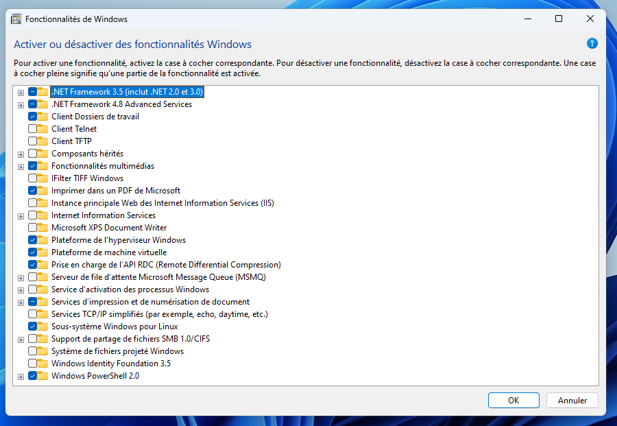

# Langage C - Module 02 : Installation de l'environnement de développement C

Paul Schuhmacher

Septembre 2024

Module: Langage C

- [Langage C - Module 02 : Installation de l'environnement de développement C](#langage-c---module-02--installation-de-lenvironnement-de-développement-c)
  - [Installer le compilateur C sur Ubuntu/Debian](#installer-le-compilateur-c-sur-ubuntudebian)
  - [Installer le compilateur C sur Windows](#installer-le-compilateur-c-sur-windows)
    - [Méthode 1 - Environnement de développement sur une distribution GNU/Linux](#méthode-1---environnement-de-développement-sur-une-distribution-gnulinux)
      - [Erreurs rencontrées et configuration de Windows](#erreurs-rencontrées-et-configuration-de-windows)
    - [Méthode 2 - Environnement de développement sur Windows directement](#méthode-2---environnement-de-développement-sur-windows-directement)
  - [Installer le compilateur gcc sur macOS](#installer-le-compilateur-gcc-sur-macos)
  - [Conclusion](#conclusion)
    - [Annexes : Se déplacer dans le terminal de Windows (Invite de commandes ou PowerShell)](#annexes--se-déplacer-dans-le-terminal-de-windows-invite-de-commandes-ou-powershell)
    - [Annexes : Se déplacer dans un shell UNIX (GNU/Linux et macOS)](#annexes--se-déplacer-dans-un-shell-unix-gnulinux-et-macos)

Pour développer en C, nous avons besoins de trois outils :

- Un éditeur de texte (Vs Code);
- Un compilateur C. Nous allons utiliser (de préférence) le compilateur C de gcc ([GNU Compiler Collection](https://fr.wikipedia.org/wiki/GNU_Compiler_Collection));
- La librairie standard : déclarations (fichiers *headers*) et implémentation (binaires)

## Installer le compilateur C sur Ubuntu/Debian

Dans un terminal :

~~~bash
#Installer le compilateur gcc
sudo apt install gcc
#Tester l'installation (cc ou gcc)
cc --version
cc --help
~~~

> `cc` est un alias de `gcc`. Vous pouvez utiliser `gcc` ou `cc` de manière interchangeable

## Installer le compilateur C sur Windows

Sur Windows, on a le choix :

- Soit on travaille dans un environnement GNU/Linux via la WSL, une machine virtuelle GNU/Linux intégrée à Windows
- Soit on travaille directement sur Windows

**Choisir une des méthodes proposées ci dessous**

### Méthode 1 - Environnement de développement sur une distribution GNU/Linux

- [Installer WSL2](https://learn.microsoft.com/fr-fr/windows/wsl/install)
- Installer une distribution GNU/Linux Ubuntu

Pour télécharger et installer WSL 2, vous pouvez vous rendre sur [la page officielle de Microsoft](https://learn.microsoft.com/fr-fr/windows/wsl/install) et suivre les instructions.

Ouvrez une Invite de commandes en mode administrateur en cliquant avec le bouton droit et en sélectionnant `"Exécuter en tant qu'administrateur"`

~~~bash
wsl --install
wsl --update
~~~

- **Ouvrir la WSL**
- Choisissez un nom d'utilisateur et un mot de passe pour le système GNU/Linux. Cet utilisateur est l'administrateur du système avec la capacité d'exécuter des commandes d'administration (`sudo`). **Gardez-les précieusement**. 
- WSL va vous ouvrir shell sur votre instance GNU/Linux. Executer les commandes suivantes pour installer le compilateur `gcc` :

~~~bash
#Mettre à jour la liste des paquets
sudo apt update
#Mettre à jour les paquets
sudo apt upgrade
#Installer le compilateur gcc
sudo apt install gcc
#Tester l'installation (cc ou gcc)
cc --version
cc --help
~~~

Vous avez à présent accès à une distribution GNU/Linux via la WSL et installé le compilateur `gcc` (ou `cc`, c'est la même chose). Cette distribution est accessible sous la forme d'une application Windows (voir une application Ubuntu)

Repérer le système de fichiers de votre distribution Ubuntu depuis Windows et placer vos fichiers sources (fichiers contenant le code C) dans le repertoire `/home/<votre utilisateur>/langage-c`. Pour cela, créer le dossier `langage-c` à cet emplacement.

Voici votre flot de travail :

- Ouvrir VS Code sur Windows;
- Ouvrir le dossier `/home/<votre utilisateur>/langage-c` de votre distribution GNU/Linux;
- Éditer votre code dans VS Code
- Lancer votre distribution Ubuntu (lancer l'application) puis compiler dans le terminal de votre distribution Ubuntu.

#### Erreurs rencontrées et configuration de Windows

En cas de problèmes avec wsl, veuillez [consulter cette page de problèmes connus](https://learn.microsoft.com/fr-fr/windows/wsl/troubleshooting) avant de demander de l'aide. Vous pouvez également consulter la FAQ pour en savoir plus.

Pour exécuter WSL 2, vous devez au préalable *activer la plateforme de machine virtuelle Windows* (appelée Hyper-V). Si ce n'est pas le cas, vous allez obtenir un message comme celui-ci `"Please enable the virtual Machine Platform WIndows feature and ensure virtualization is enabled in the BIOS"`. 

Pour activer la plateforme de virtualisation, redémarrer votre machine, appuyez sur `F2` ou la touche indiquée indiquée par votre carte-mère pour accéder au BIOS. Vous devez également vous assurer que les fonctionnalités Plateforme de l'hyperviseur Windows et Plateforme de machine virtuelle sont bien activées. Tapez `“fonctionnalités windows”` dans votre barre de recherche, puis activez-les. **Redémarrez votre machine**. 

Vérifier l'installation en tapant la commande suivante dans l'invite de commande windows :

~~~bash
systeminfo
~~~

La dernière entrée du rapport généré vous indiquera la configuration requise pour Hyper-V. Vérifier que tous les prérequis sont bien remplis.

Enfin, pour lister les distributions installées :

~~~bash
wsl -l -v
~~~

### Méthode 2 - Environnement de développement sur Windows directement

<!-- **Choisir une méthode parmi les deux proposées**

#### Soit via Visual Studio et le compilateur clang

- Télécharger et installer [Build Tools pour Visual Studio](https://visualstudio.microsoft.com/fr/downloads/);
- Dans le programme d’installation de Visual Studio, sélectionnez le **développement Desktop avec la charge de travail C++**. Cela installera [le compilateur C/C++ `clang`](https://fr.wikipedia.org/wiki/Clang)
- Ouvrir une *Invite de Commande Windows* et taper `cl` pour vérifier que le programme est bien installé :

~~~bash
>cl
Microsoft (R) C/C++ Optimizing Compiler Version 19.10.25017 for x86
Copyright (C) Microsoft Corporation.  All rights reserved.

usage: cl [ option... ] filename... [ /link linkoption... ]
~~~ -->

**`gcc` est un programme qui n'existe pas nativement sur Windows**. Pour l'utiliser *quand même*, il existe des projets comme [MinGW](https://www.mingw-w64.org/) (Minimal GNU for Windows). MinGW est une *adaptation* (un "port") à l'environnement Windows des logiciels de développement du projet GNU (dont `gcc` fait partie).

- [Télécharger l'archive mingw proposée par Winlibs](https://winlibs.com/#download-release) (prendre la dernière version).
- Extraire l'archive n'importe où sur votre disque;
- Pour accéder au programme `gcc` depuis n'importe où dans l'Invite de Commandes Windows, il faut ajouter le chemin du dossier précédemment extrait au `PATH`. Ouvrir le panneau de configuration des variables d'environnement Windows et ajouter le chemin `mingw64/bin/` à la variable `PATH`
- Ouvrir une nouvelle invite de Commandes Windows
- Tester l'installation
  
~~~bash
gcc --version
~~~

> Vous pouvez aussi installer et utiliser le compilateur [`clang`](https://fr.wikipedia.org/wiki/Clang) que vous pouvez installer via la suite [Visual Studio](https://visualstudio.microsoft.com/fr/downloads/) natif à Windows. Les options du compilateur ne seront pas les mêmes. [Suivre cette procédure](https://learn.microsoft.com/fr-fr/cpp/build/walkthrough-compile-a-c-program-on-the-command-line?view=msvc-170#prerequisites)

## Installer le compilateur gcc sur macOS

Ouvrir un terminal.

- Installer les outils de la suite Xcode

~~~bash
xcode-select --install
~~~

- Installer [le gestionnaire de paquets homebrew](https://brew.sh/)

~~~bash
/bin/bash -c "$(curl -fsSL https://raw.githubusercontent.com/Homebrew/install/HEAD/install.sh)"
~~~

- Installer `gcc` via homebrew

~~~bash
brew install gcc
#Tester
gcc --version
~~~

## Conclusion

A la fin de cette étape, vous devez :

- Avoir un compilateur C fonctionnel (de préférence `gcc`, ou clang);
- Avoir installé l'éditeur VS Code.
- Savoir vous déplacer dans un terminal Windows ou UNIX (GNU/Linux et macOS);

### Annexes : Se déplacer dans le terminal de Windows (Invite de commandes ou PowerShell)

~~~bash
#Savoir où on est (afficher le dossier courant)
cd
chdir
#Lister les fichiers dans le repertoire courant
dir
#Se déplacer dans un dossier
cd /chemin/du/dossier
#Revenir en arrière
cd ..
#Executer le programme a.exe
./a.exe
~~~

### Annexes : Se déplacer dans un shell UNIX (GNU/Linux et macOS)

~~~bash
#Savoir où on est (afficher le dossier courant)
pwd
#Lister les fichiers dans le repertoire courant
ls
#Se déplacer dans un dossier
cd /chemin/du/dossier
#Revenir dans le dossier parent
cd ..
#Executer le programme a.out
./a.out
#Créer un fichier main.c
touch main.c
~~~